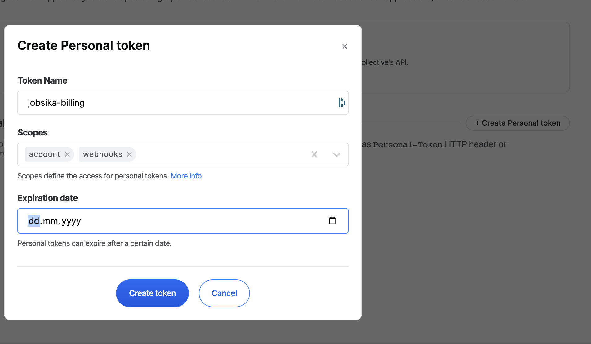
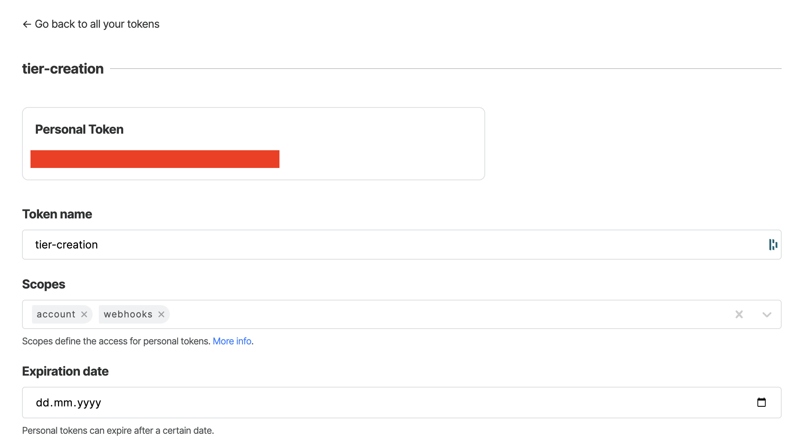

# Open collective payment

The payment method we use for jobsika is based off of the opencollective [GraphQL API](https://graphql-docs-v2.opencollective.com/welcome).
We are using opencollective because the money that we receive lands directly on our opencollective account.
Which makes it easier to access that money and spend it in the open.

### How to develop ?

You are a developer and you would like to test or modify our payment solution. You are at the right the place,
this document aims to provide you enough information to get you started.

#### Prerequisites

In order to contribute to the payment solution you will need to have an account to opencollective, and have admin
access to an organisation.

You can request admin access to [openbilling](https://opencollective.com/openbilling), [osscameroon](https://opencollective.com/osscameroon) or create your own organisation.


Once you have admin access to an organisation, you need to generate an API Key. To do so, go to your personal settings on opencollective select the `For developers` section and create a new personal token.
Make sure you to set the `Account` and `Webhooks` scopes for that personal token.

**For developers tab**


**Create a new token**




**Copy your personal token**




#### Setup

Once you have your personal token, clone the [jobsika](https://github.com/osscameroon/jobsika) repository and head to the `./backend` folder.
Copy the `.opencollective-env-example` and rename it to `.opencollective-env`. Then replace the `OPENCOLLECTIVE_API_KEY` with your personal token.
and the `OPENCOLLECTIVE_ORG_SLUG` with the slug of the organisation you have admin access to.

Now you should be able to run the backend and make payment requests.

Run the api using `make start-api`

Then run the command `curl -vsS -X POST -H 'Content-Type: application/json' -d '{"email":"test@email.com", "tier": "je suis con", "job_offer_id": "1"}' http://localhost:7001/pay | jq`

You should have a similar output to:

```
{
  "tier_url": "https://opencollective.com/osscameroon/contribute/jobsika-joboffer-56908"
}
```

The `tier_url` is the link to the newly created payment tier.


Before you can proceed to the next step you must setup a `Webhook`. Go to the organisation profile and select the `Webhooks` tab.
Then click on `Add a new webhook` and fill the form as shown bellow.

You will need to expose your local api to the internet. You can use [ngrok](https://ngrok.com/) to do so.

Once you have generated a public url, you can set the URL field to `https://<whatever-your-ngrok-domain-is>/open-collective-webhook`.
The `/open-collective-webhook` is the endpoint that the api exposes to receive webhooks from opencollective.

**Webhook form**
[](./res/webhook-form.png)


Now you can go back to the `tier_url` your received from the previous payment request and click on the `Pay now` button.
